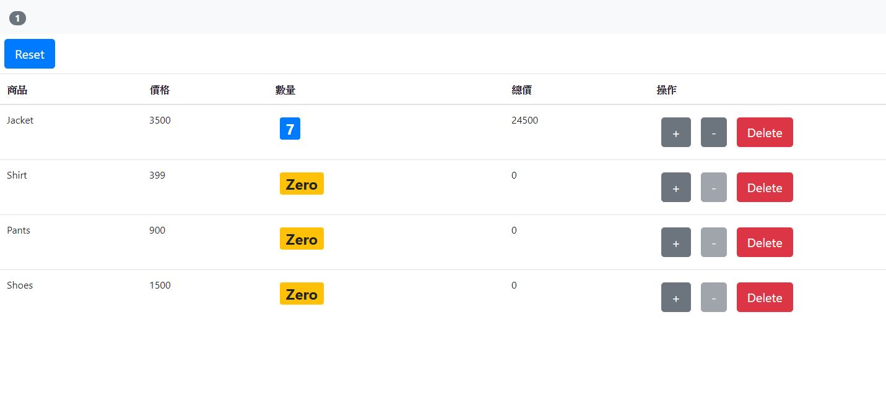

<h1> <a href="https://tdtb12.github.io/React_ShoppingCart">React Shopping Cart </a> </h1>
</img>
共有三個components組成，分別為Navbar、購物車表格、商品資訊及操作，Navbar上顯示選取了幾種商品，若商品數量為零則減號按鈕為disables並且數量顯示黃底Zero，Navbar下方Reset鈕可以將商品數量都歸零。

